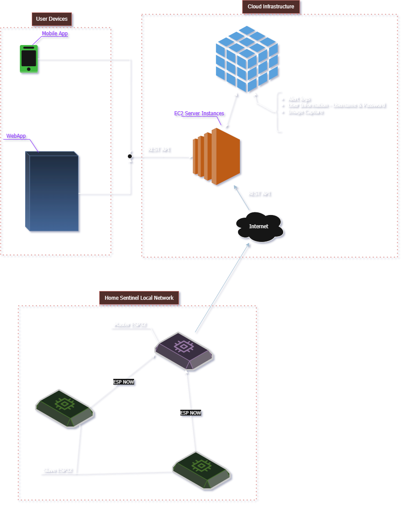

# PROJECT: HOME_SENTINEL  

## Table of Contents  
1. [Abstract](#abstract)  
2. [Features](#features)  
3. [Hardware Requirements](#hardware-requirements)  
4. [System Architecture](#system-architecture)  
5. [Software Requirements](#software-requirements)  
6. [Installation & Setup](#installation--setup)  
7. [Contributing](#contributing)  
8. [Roadmap](#roadmap)  

---

## Abstract  
Home security systems often cost a fortune – why not build your own? Introducing **HOME_SENTINEL**:  
A lightweight, privacy-focused security system using **Espressif ESP32** microcontrollers. It controls sensors, locks, and alarms via **ESP-NOW**, a low-latency, peer-to-peer protocol, and integrates with client applications through a lightweight **HTTP REST API**. Designed for DIY enthusiasts seeking affordability and customization.

---

## Features  
- **Motion Detection**: Supports PIR sensors or a custom [Laser-Based Detection System](https://github.com/Minibunny14/Laser-Based-Obstruction-Detection-System).  
- **ESP-NOW Communication**: Direct device-to-device messaging without Wi-Fi dependency.  
- **HTTP REST API**: Enables communication between the ESP32 and mobile/desktop apps for remote commands and status updates.  
- **Remote Control**: Arm/disarm the system via REST API calls from a companion app or script.  
- **Smart Lock Integration**: Magnetic/solenoid door locks triggered by detection events.  
- **Alarm System**: Activates a buzzer or piezoelectric alarm on unauthorized access.  
- **Status Indicators**: LEDs or built-in ESP32 LEDs show system status (armed/disarmed).  
- **Expandable Design**: Add sensors via GPIO pins or ESP-NOW nodes.  
- **No Cloud Dependency**: Fully local operation for enhanced privacy.  

---

## Hardware Requirements  
1. **ESP32 Microcontroller** (primary node).  
2. **Detection Unit**: PIR sensor or DIY laser-based system.  
3. **Magnetic Lock/Solenoid**: For door/window control.  
4. **Buzzer/Piezo Alarm**: Audible alert system.  
5. **LEDs** (optional): For visual status (or use ESP32’s built-in LED).  
6. **Secondary ESP32 Nodes**: For multi-room coverage (optional).  
7. Breadboard + jumper wires.  
8. 5V power supply or USB cable.  

---

## System Architecture  
  

1. **Primary ESP32** acts as the central hub.  
2. **Secondary ESP32 Nodes** (e.g., motion sensors, door locks) communicate directly with the hub via ESP-NOW.  
3. **Alarm/Lock Modules** trigger based on ESP-NOW messages from sensors.  
4. **Companion App** interacts with the primary node via **HTTP REST API** to send arm/disarm commands and retrieve status.

---

## Software Requirements  
- **Arduino IDE** or **PlatformIO** (for ESP32 firmware).  
- **ESP-NOW Library** (built into ESP32 Arduino Core).  
- **Sensor Libraries** (e.g., Adafruit PIR library).  
- **ESPAsyncWebServer** or similar for REST API support.  
- **Optional**: Companion app using HTTP (e.g., Python requests, Android app).  

---

## Installation & Setup  
**Clone Repository**:  
   ```bash  
   git clone https://github.com/yourusername/HOME_SENTINEL.git 
   ```

---

## Contributing

We welcome contributions from developers, hobbyists, and security enthusiasts! Here's how you can get involved:

1. **Fork the Repository**:

Click the `Fork` button at the top right to create your own copy of the project.
2. **Clone Your Fork**:
```bash
git clone https://github.com/yourusername/HOME_SENTINEL.git
cd HOME_SENTINEL
```
3. **Create a Branch**:
```bash
git checkout -b feature/your-feature-name
```
4. **Make Your Changes**:

Add features, fix bugs, or improve documentation.
5. **Commit and Push**:
```bash
git commit -m "Add: Description of your change"
git push origin feature/your-feature-name
```
6. **Create a Pull Request**:

Submit your PR with a clear explanation of what you’ve added or changed.

---

## Roadmap
- [ ] This is an unchecked checkbox
- [x] This is a checked checkbox